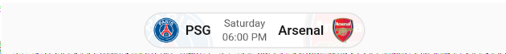
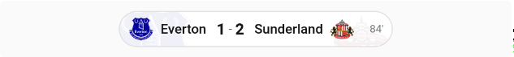
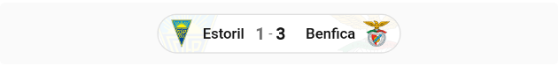
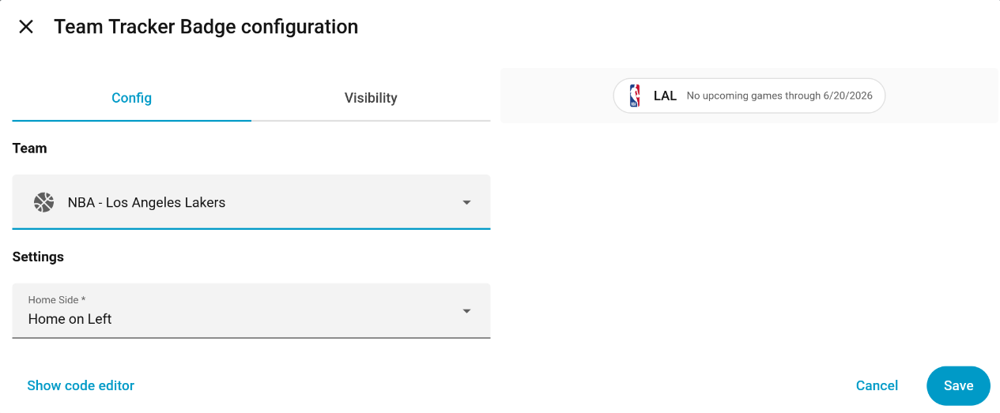

# Home Assistant Team Tracker Badge

A minimal Home Assistant frontend custom badge that displays real-time sports scores for teams tracked with the [ha-teamtracker](https://github.com/vasqued2/ha-teamtracker) integration.

This project was based on the [ha-teamtracker-card](https://github.com/vasqued2/ha-teamtracker-card) by [@vasqued2](https://github.com/vasqued2). It relies on the same [ha-teamtracker](https://github.com/vasqued2/ha-teamtracker) integration.

**Scope:** This badge intentionally shows only the essentials — logos, team names, score, and clock. It is designed to be compact and unobtrusive. If you need odds, possession indicators, win probability bars, timeouts, or any other detail, use [ha-teamtracker-card](https://github.com/vasqued2/ha-teamtracker-card) instead.

**Sport support:** This badge has been mostly tested with soccer. Pull requests are welcome to improve support for other sports.

---

### PRE Game (Upcoming)



### IN Game (Live)



### POST Game (Final)



### Editor



---

## HACS Installation

[](https://my.home-assistant.io/redirect/hacs_repository/?owner=adaxi&repository=ha-teamtracker-badge&category=frontend)

_OR_ manually:

1. Open the HACS section of Home Assistant.
2. Click the **"+ EXPLORE & DOWNLOAD REPOSITORIES"** button.
3. Search for **"Team Tracker Badge"**.
4. Select it from the list and click **Download**.
5. Reload when prompted.

HACS will automatically add the following resource:
```yaml
url: /hacsfiles/ha-teamtracker-badge/ha-teamtracker-badge.js
type: module
```

## Manual Installation

1. Download [ha-teamtracker-badge.js](https://github.com/adaxi/ha-teamtracker-badge/blob/main/dist/ha-teamtracker-badge.js)
2. Copy it to `www/community/ha-teamtracker-badge/`
3. Add the following to your resources:
```yaml
url: /hacsfiles/ha-teamtracker-badge/ha-teamtracker-badge.js
type: module
```

---

## Adding the Badge to the Dashboard

Add a **Manual Badge** to your dashboard and enter the YAML configuration.

### Options

| Name | Description | Default | Required |
| --- | --- | --- | --- |
| `entity` | The `ha-teamtracker` sensor entity | — | Yes |
| `home_side` | Force home team to a specific side | Team on left | No — `left` / `right` |

### Minimal Configuration

```yaml
type: custom:teamtracker-badge
entity: sensor.my_team
```

Where `sensor.my_team` is the sensor name from the [ha-teamtracker](https://github.com/vasqued2/ha-teamtracker) integration.

### Home Side Example

```yaml
type: custom:teamtracker-badge
entity: sensor.my_team
home_side: left
```
